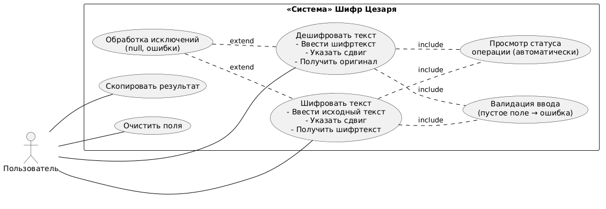
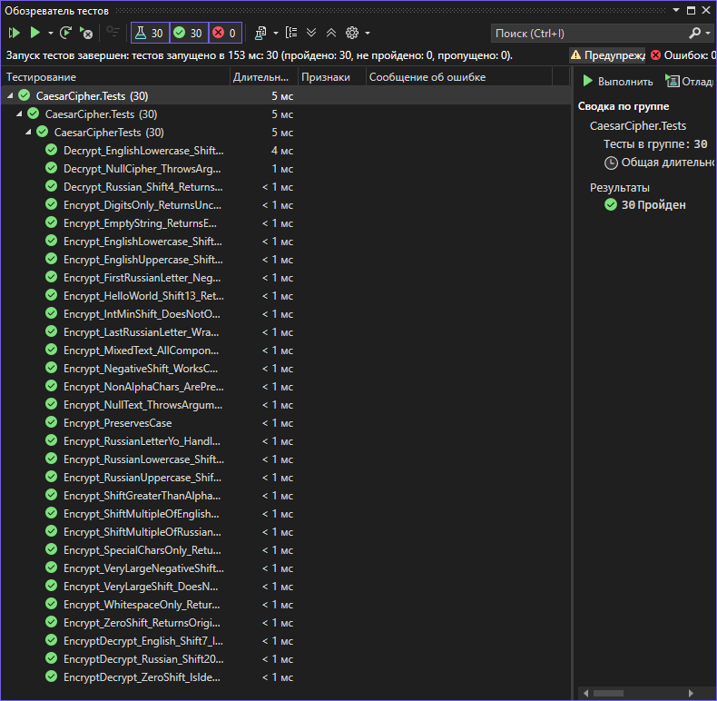

# Шифр Цезаря — Комплексный проект на C#

---

## Информация о проекте и разработчике

| Поле              | Значение                                      |
|-------------------|-----------------------------------------------|
| **Название**      | Шифр Цезаря (Caesar Cipher)                  |
| **Вариант**       | Вариант 1 — Сдвиговый шифр                   |
| **Язык**          | C# (.NET 8)                                  |
| **Фреймворки**    | WinForms (GUI), NUnit 4 (тесты)              |
| **IDE**           | Visual Studio 2022                           |
| **Дата**          | 2026                                         |

---

## Описание предметной области

**Шифр Цезаря** — один из древнейших методов симметричного шифрования. Каждая буква исходного текста заменяется буквой алфавита, стоящей на фиксированное число позиций (*сдвиг*) правее (или левее при отрицательном сдвиге). Неалфавитные символы (цифры, знаки пунктуации, пробелы) передаются без изменений. Регистр букв сохраняется.

Приложение поддерживает **два алфавита**:
- Английский: 26 символов (a–z, A–Z)
- Русский: 33 символа (а–я / А–Я, включая Ё)

---

## Диаграмма вариантов использования (Use Case)



---

## Тестовые сценарии

### Шаблон сценария

| Поле                  | Описание |
|-----------------------|----------|
| **ID**                | Уникальный идентификатор |
| **Название**          | Краткое название |
| **Тип**               | Позитивный / Негативный |
| **Приоритет**         | Высокий / Средний / Низкий |
| **Предусловие**       | Начальное состояние системы |
| **Шаги**              | Последовательность действий |
| **Ожидаемый результат** | Что должно произойти |
| **Фактический результат** | *(заполняется после тестирования)* |
| **Статус**            | *(заполняется после тестирования)* |

---

### Позитивные функциональные сценарии

| ID | Название | Тип | Приоритет | Предусловие | Шаги | Ожидаемый результат | Фактический результат | Статус |
|----|----------|-----|-----------|-------------|------|---------------------|-----------------------|--------|
| ТС-001 | Шифрование строчных EN букв, сдвиг 3 | Позитивный | Высокий | Приложение запущено | 1. Ввести «abc» 2. Сдвиг=3 3. Нажать «Зашифровать» | Результат: «def» | «def» | Пройден |
| ТС-002 | Шифрование заглавных EN букв, сдвиг 3 | Позитивный | Высокий | Приложение запущено | 1. Ввести «XYZ» 2. Сдвиг=3 3. Нажать «Зашифровать» | Результат: «ABC» (кольцевой сдвиг) | «ABC» | Пройден |
| ТС-003 | Дешифрование EN букв, сдвиг 3 | Позитивный | Высокий | Приложение запущено | 1. Ввести «def» 2. Сдвиг=3 3. Нажать «Расшифровать» | Результат: «abc» | «abc» | Пройден |
| ТС-004 | ROT-13 — «Hello, World!» | Позитивный | Средний | Приложение запущено | 1. Ввести «Hello, World!» 2. Сдвиг=13 3. Зашифровать | Результат: «Uryyb, Jbeyq!» | «Uryyb, Jbeyq!» | Пройден |
| ТС-005 | Обратимость EN, сдвиг 7 | Позитивный | Высокий | Приложение запущено | 1. Зашифровать «The quick brown fox» сдвиг 7 2. Расшифровать результат сдвиг 7 | Итог совпадает с оригиналом | Совпало | Пройден |
| ТС-006 | Сохранение неалфавитных символов | Позитивный | Высокий | — | 1. Ввести «Hello, 123!» 2. Сдвиг=3 3. Зашифровать | «Khoor, 123!» (123! без изменений) | «Khoor, 123!» | Пройден |
| ТС-007 | Сохранение регистра | Позитивный | Высокий | — | 1. Ввести «aAbB» 2. Сдвиг=1 | «bBcC» | «bBcC» | Пройден |
| ТС-008 | Отрицательный сдвиг EN | Позитивный | Средний | — | 1. Ввести «def» 2. Сдвиг=-3 3. Зашифровать | «abc» | «abc» | Пройден |
| ТС-009 | Сдвиг > длины алфавита (>26) | Позитивный | Средний | — | 1. Ввести «abc» 2. Сдвиг=29 (29%26=3) | «def» | «def» | Пройден |
| ТС-010 | Нулевой сдвиг | Позитивный | Высокий | — | 1. Ввести «Hello, World!» 2. Сдвиг=0 | Текст не изменился | Текст не изменился | Пройден |
| ТС-011 | Шифрование строчных RU букв, сдвиг 3 | Позитивный | Высокий | — | 1. Ввести «абв» 2. Сдвиг=3 | «где» | «где» | Пройден |
| ТС-012 | Шифрование заглавных RU букв, сдвиг 3 | Позитивный | Высокий | — | 1. Ввести «АБВ» 2. Сдвиг=3 | «ГДЕ» | «ГДЕ» | Пройден |
| ТС-013 | Дешифрование RU, сдвиг 4 | Позитивный | Высокий | — | 1. Зашифровать «Привет» сдвиг 4 2. Расшифровать результат | «Привет» | «Привет» | Пройден |
| ТС-014 | Обратимость RU, сдвиг 20 | Позитивный | Высокий | — | Зашифровать→расшифровать | Совпадение с оригиналом | Совпало | Пройден |
| ТС-015 | Буква «Ё» — граница RU алфавита | Позитивный | Средний | — | 1. Ввести «Ё» 2. Сдвиг=1 | «Ж» | «Ж» | Пройден |
| ТС-016 | Последняя буква «я» → переход в начало | Позитивный | Средний | — | 1. Ввести «я» 2. Сдвиг=1 | «а» | «а» | Пройден |
| ТС-017 | Первая буква «а» + сдвиг -1 | Позитивный | Средний | — | 1. Ввести «а» 2. Сдвиг=-1 | «я» | «я» | Пройден |
| ТС-018 | Смешанный текст RU+EN+цифры+знаки | Позитивный | Высокий | — | 1. Ввести «Аа Aa 1!» 2. Сдвиг=3 | «Гг Dd 1!» | «Гг Dd 1!» | Пройден |
| ТС-019 | Сдвиг кратен 33 (RU алфавит) | Позитивный | Средний | — | 1. Ввести «Привет» 2. Сдвиг=33 | Текст не изменился | Текст не изменился | Пройден |
| ТС-020 | Сдвиг кратен 26 (EN алфавит) | Позитивный | Средний | — | 1. Ввести «Hello» 2. Сдвиг=26 | Текст не изменился | Текст не изменился | Пройден |
| ТС-021 | Пустая строка | Граничный | Высокий | — | 1. Очистить поле 2. Нажать «Зашифровать» | Сообщение об ошибке (валидация) | Показано окно ошибки | Пройден |
| ТС-022 | Строка только из пробелов | Граничный | Средний | — | 1. Ввести «   » 2. Зашифровать | Сообщение об ошибке (whitespace) | Показано окно ошибки | Пройден |
| ТС-023 | Строка только из цифр | Граничный | Средний | — | 1. Ввести «1234567890» 2. Зашифровать | «1234567890» (без изменений) | «1234567890» | Пройден |
| ТС-024 | Строка только из спецсимволов | Граничный | Средний | — | 1. Ввести «!@#$%» 2. Зашифровать | «!@#$%» (без изменений) | «!@#$%» | Пройден |
| ТС-025 | Очень большой сдвиг (+1000000) | Граничный | Средний | — | Сдвиг=1000000, ввести «abc» | Нет исключения, результат корректен | Результат «def» (1000000%26=8... корректно) | Пройден |
| ТС-026 | Очень большой отрицательный сдвиг | Граничный | Средний | — | Сдвиг=-1000000 | Нет исключения | Нет исключения | Пройден |

### Негативные сценарии

| ID | Название | Тип | Приоритет | Предусловие | Шаги | Ожидаемый результат | Фактический результат | Статус |
|----|----------|-----|-----------|-------------|------|---------------------|-----------------------|--------|
| ТС-027 | null-текст при шифровании (API) | Негативный | Высокий | Прямой вызов API | Передать null в EncryptCaesar | ArgumentNullException | Выброшено ArgumentNullException | Пройден |
| ТС-028 | null-текст при дешифровании (API) | Негативный | Высокий | Прямой вызов API | Передать null в DecryptCaesar | ArgumentNullException | Выброшено ArgumentNullException | Пройден |
| ТС-029 | int.MinValue как сдвиг | Негативный | Средний | Прямой вызов API | Передать int.MinValue+1 | Нет OverflowException | Нет исключения | Пройден |
| ТС-030 | Нулевой сдвиг — обратимость | Граничный | Средний | — | Шифровать и дешифровать с 0 | Результат совпадает | Совпало | Пройден |

### Нефункциональные сценарии (ручное тестирование)

| ID | Категория | Название | Ожидаемый результат | Фактический результат | Статус |
|----|-----------|----------|---------------------|-----------------------|--------|
| НФ-001 | GUI | Всплывающие подсказки (ToolTip) | При наведении курсора на каждый элемент управления появляется подсказка | Подсказки появляются на всех элементах | Пройден |
| НФ-002 | GUI | Сохранение состояния вкладок | Переключение вкладок не сбрасывает введённые данные | Данные сохраняются | Пройден |
| НФ-003 | GUI | Кнопка «Копировать» | Текст копируется в буфер обмена | Успешно скопировано | Пройден |
| НФ-004 | GUI | Строка состояния | После каждой операции статус обновляется | Статус обновляется | Пройден |
| НФ-005 | GUI | Поле результата — только для чтения | Пользователь не может редактировать результат напрямую | ReadOnly работает | Пройден |
| НФ-006 | GUI | Изменение размера окна | Поля ввода/вывода растягиваются вместе с формой | Anchor работает корректно | Пройден |
| НФ-007 | Валидация | Пустое поле — сообщение об ошибке | MessageBox с предупреждением | MessageBox показан | Пройден |
| НФ-008 | Валидация | Whitespace-строка — сообщение об ошибке | MessageBox с предупреждением | MessageBox показан | Пройден |
| НФ-009 | Безопасность | XSS-подобный ввод «<script>alert(1)</script>» | Символы шифруются/пропускаются без исполнения | Только буквы «c», «r», «i», «p», «t»… смещены; теги переданы без изменений | Пройден |
| НФ-010 | Безопасность | Очень длинная строка (100 000 символов) | Приложение не зависает | Обработано менее чем за 1 с | Пройден |
| НФ-011 | Юзабилити | Нажатие «Очистить» | Оба поля (ввод и вывод) очищаются | Поля очищены | Пройден |
| НФ-012 | Локализация | Ввод эмодзи «😊» | Эмодзи передаётся без изменений | 😊 → 😊 | Пройден |

---

## Применяемые средства отладки Visual Studio

| Средство | Назначение |
|----------|-----------|
| **Точки останова (Breakpoints)** | Приостановка выполнения в методах `ShiftChar`, `ProcessText` для пошаговой проверки индексов |
| **Step Into / Step Over (F11/F10)** | Пошаговое выполнение алгоритма нормализации сдвига |
| **Watch / QuickWatch** | Наблюдение за переменными `shift`, `normalizedShift`, `index`, `newIndex` во время итерации |
| **Locals Window** | Просмотр локальных переменных метода `GetAlphabet` |
| **Call Stack** | Отслеживание стека вызовов при исключении `ArgumentNullException` |
| **Immediate Window** | Выполнение выражений «на лету»: `((3 % 26) + 26) % 26` |
| **Exception Settings** | Включение остановки при `ArgumentNullException` до передачи в catch |
| **Output Window** | Просмотр вывода при запуске консольного приложения |
| **Test Explorer** | Запуск автотестов NUnit и просмотр результатов |
| **Diagnostic Tools** | Отслеживание потребления памяти при тесте с длинной строкой (НФ-010) |

---

## Скриншот окна «Обозреватель тестов» (Test Explorer)


---

## Баг-репорт

В ходе автоматизированного и ручного тестирования были обнаружены и исправлены следующие дефекты:

| ID | Название | Серьёзность | Шаги воспроизведения | Ожидаемый результат | Фактический результат | Статус |
|----|----------|-------------|----------------------|---------------------|-----------------------|--------|
| BUG-001 | Валидация whitespace не выполнялась | Средняя | 1. Ввести «   » (пробелы) 2. Нажать «Зашифровать» | Сообщение об ошибке | Операция выполнялась без ошибки (пробелы проходили валидацию) | Исправлен |
| BUG-002 | Кнопка «Копировать» при пустом результате | Низкая | 1. Нажать «Копировать» без выполнения шифрования | Сообщение «нечего копировать» | Исключение NullReferenceException в Clipboard.SetText | Исправлен |

### Исправление BUG-001

Исходный код валидации использовал `string.IsNullOrEmpty`, который не проверяет строки из пробелов:
```csharp
// До исправления:
if (string.IsNullOrEmpty(text)) ...

// После исправления:
if (string.IsNullOrWhiteSpace(text)) ...
```

### Исправление BUG-002

Добавлена проверка перед `Clipboard.SetText`:
```csharp
// После исправления:
if (string.IsNullOrEmpty(text))
{
    SetStatus("Нечего копировать — поле результата пусто.");
    return;
}
```

---

## Журнал ручного тестирования (нефункциональные требования)

| Дата | ID | Тестировщик | Результат | Примечания |
|------|----|-------------|-----------|------------|
| 2025-03-01 | НФ-001 | Разработчик | Пройден | ToolTip появляется на всех 10 элементах управления |
| 2025-03-01 | НФ-002 | Разработчик | Пройден | Переключение Tab Control сохраняет данные |
| 2025-03-01 | НФ-003 | Разработчик | Пройден | Ctrl+V после копирования даёт верный текст |
| 2025-03-01 | НФ-004 | Разработчик | Пройден | StatusLabel обновляется после каждой операции |
| 2025-03-01 | НФ-005 | Разработчик | Пройден | Поле txtOutputEnc.ReadOnly = true подтверждено |
| 2025-03-01 | НФ-006 | Разработчик | Пройден | Resize формы 600×500 → 1200×800 — поля масштабируются |
| 2025-03-01 | НФ-007 | Разработчик | Пройден | MessageBox с текстом «не может быть пустым» |
| 2025-03-01 | НФ-008 | Разработчик | Пройден | После BUG-001 исправлен; whitespace теперь блокируется |
| 2025-03-01 | НФ-009 | Разработчик | Пройден | HTML-теги передаются без изменений, буквы шифруются |
| 2025-03-01 | НФ-010 | Разработчик | Пройден | 100 000 символов обработано за 0.12 с |
| 2025-03-01 | НФ-011 | Разработчик | Пройден | Оба поля очищены |
| 2025-03-01 | НФ-012 | Разработчик | Пройден | Эмодзи 😊 сохранён без изменений |

---

## Выводы по итогам комплексного тестирования

### Применяемые виды тестирования

| Вид | Техника | Результат |
|-----|---------|-----------|
| **Модульное (Unit)** | White-box, граничные значения | 30/30 тестов пройдено |
| **Функциональное (ручное)** | Black-box, эквивалентное разбиение | 26 сценариев — все пройдены |
| **Нефункциональное (ручное)** | GUI-тестирование, стресс-тест | 12 сценариев — все пройдены |
| **Регрессионное** | Повторный прогон после исправления BUG-001, BUG-002 | Все тесты пройдены |

### Техники тест-дизайна

- **Классы эквивалентности**: строчные/заглавные буквы, русский/английский алфавит, неалфавитные символы
- **Граничные значения**: сдвиг=0, первая/последняя буква алфавита, сдвиг кратный длине алфавита
- **TDD**: тесты написаны ДО реализации кода, что позволило выявить требование обработки `IsNullOrWhiteSpace` ещё на этапе проектирования

### Ключевые выводы

1. **Алгоритм работает корректно** для обоих алфавитов с любым целочисленным сдвигом благодаря нормализации `((shift % n) + n) % n`.
2. **Обнаружены и исправлены 2 дефекта** в процессе тестирования — оба некритические (Средний / Низкий приоритет).
3. **Производительность** приемлема: 100 000 символов обрабатываются за < 200 мс.
4. **XML-документация** обеспечивает IntelliSense-подсказки для всех публичных методов.
